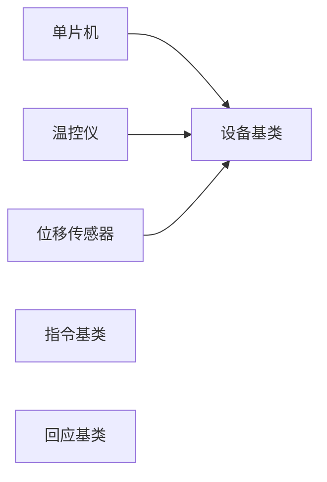
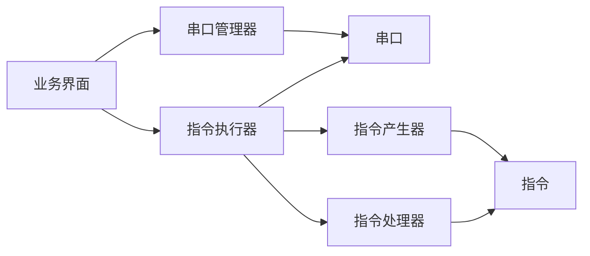
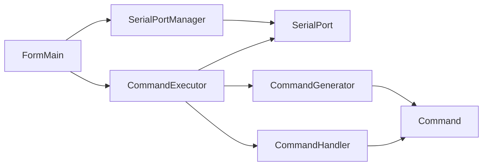

# 高温强度仪

## 硬件连接方式更改

* 之前单片机、温控仪、位移传感器分别由一个串口与主机相连，故由三根串口线与主机相连
* 现变为温控仪与位移传感器合用一个串口与主机相连，连接温控仪时，必须断开位移传感器；连接位移传感器时，要断开温控仪连接

## 主程序

## 调试工具的开发

* 为了单独调试各个设备的工具

## 程序结构

### 逻辑图

### 逻辑图

### 类图

